# Empowering Data Science with Large Language Models (LLM) - Proof of Concept
Author: Diego Martos

(last update: 2024/10/08)

The EDA project aims to enrich the Data Science experience by leveraging Azure Cloud-based AI/ML resources. This initiative is designed to inspire creativity, curiosity, and empowerment within the team, enabling them to utilize Large Language Models (LLM) to enhance end-user experiences with minimal to no data science skills.

This has been thought as a ready to deploy base code, and it assumes some pre-requsites to be fully and successfully leveraged by someone with certain familiarity and experience with some key competences, in order to aid on your competence skills combining the best of the three worlds:
- Data Science and Power of Data Insights
- Azure Cloud Computing
- Artificial Inteligence and Machine Learning (AIML)

To be successful, it is recommended (but not necessary) a minimum familiarization with the following :
- Python Skills (basic - to - intermediate)
- AIML Fundamentals
- Azure Cloud Computing Fundamentals
- Data Science Fundamentals

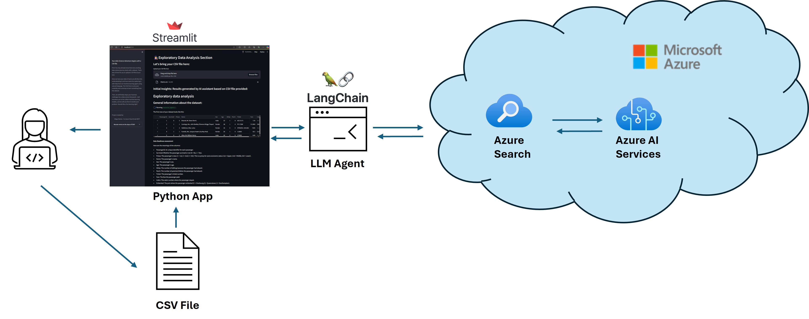

---

## Table of Contents

1. POC Overview
2. Creating required resources in your Azure environment
3. Installation (Local Laptop, Server, etc..)
4. Update the python code settings
5. Running the Application
6. Next Steps
7. Supporting Documentation

---

### Step 1: POC Overivew

Project Definition: Exploratory Data Analytics (EDA)

. By employing a data science assessment methodology, the project seeks to drive exploration of data sources and identify potential target audiences for a Proof of Concept (PoC) with perceived business value.

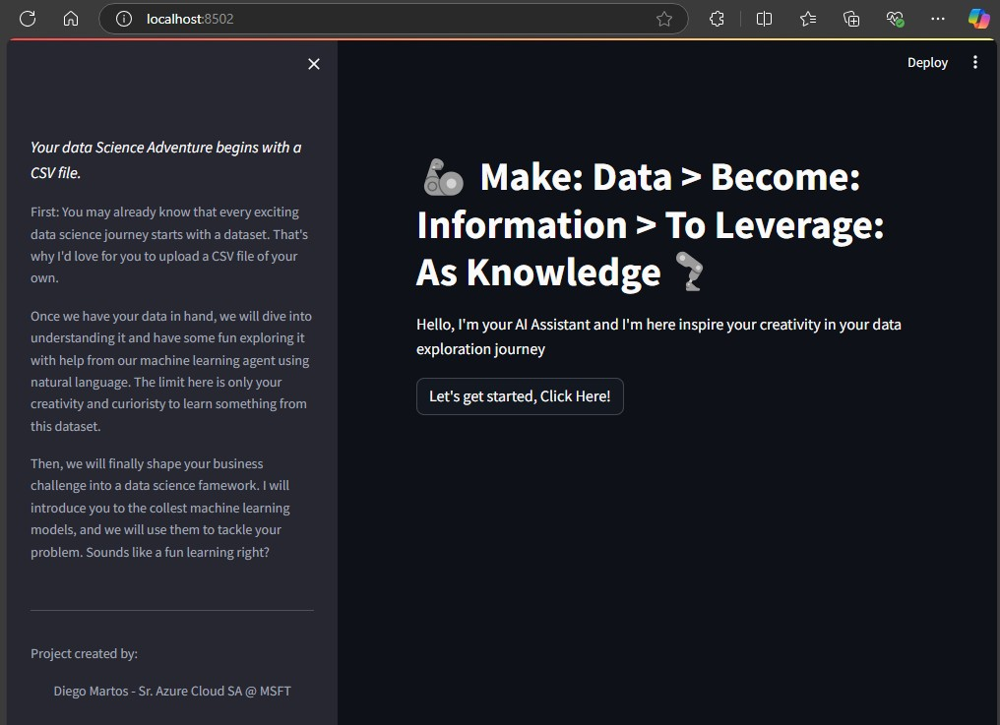

Objectives:
- Inspire creativity and curiosity within the team.
- Empower team members to leverage LLM for enriching end-user experiences.
- Utilize data science assessment methodology to explore data sources.
- Identify potential internal or external audiences for a PoC with perceived business value.

Potential Use Cases:
- Enhanced productivity.
- Gaining new insights.
- Accelerating new employees' adaptation using data in their everyday tasks.
- Improving end-user experience.
- Promoting data literacy and democracy.
- Identify other (new) relevant use cases.

Here are some examples of how this tool helps with familiarization and inspiring the curiosity to correlate with possible use cases of relevance to your own scenarios:

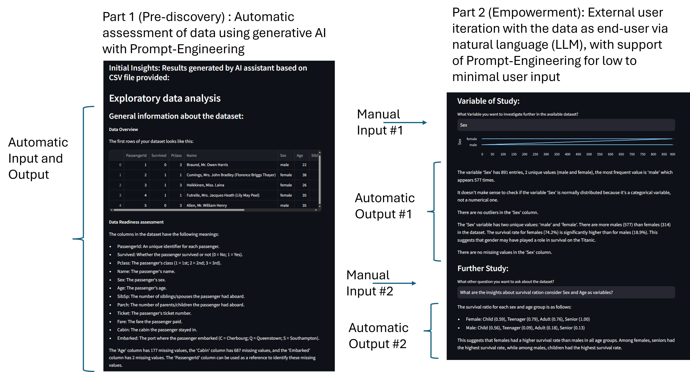

---

### Step 2: Creating required resources in your Azure environment

Here are the descriptions along with the steps for deploying the two main Azure resources required for the most simplistic use case:

$Azure Search Service$

- Azure Search Service, also known as Azure AI Search, provides secure information retrieval at scale over user-owned content in traditional and generative AI search applications. It offers features like AI enrichment, semantic reranking, and vector search, making it a powerful tool for enhancing search capabilities within applications.

For more details, you can refer to the official Microsoft documentation to create this resoruce here: <https://learn.microsoft.com/en-us/azure/search/search-create-service-portal>

Once you create an Azure Search Service, you will need to collect the following information about the service:

a. Access Key: (Example - aa0bb1c2d97543dd94b72aa71a6c15d5)

b. Private Endpoint: (Example - https://*'YourAzureOpenAiResourceName'*..search.windows.net/)

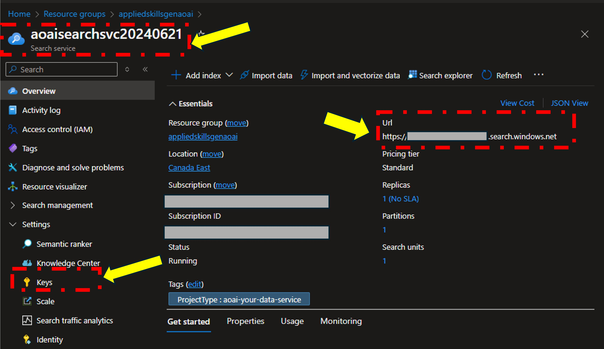

$Azure OpenAI$

- Azure OpenAI Service provides access to OpenAI's models, including GPT-4, GPT-3.5-Turbo, DALL-E 3, and Embeddings model series, with the security and enterprise capabilities of Azure. This service allows developers to integrate advanced AI models into their applications, enabling capabilities like natural language understanding, text generation, and image creation.

For more details, you can refer to the official Microsoft documentation here: https://learn.microsoft.com/en-us/azure/ai-services/openai/how-to/create-resource

Once you create an Azure Search Service, you will need to collect the following information about the service:

a. Access Key: (Example - aa0bb1c2d97543dd94b72aa71a6c15d5)

b. Private Endpoint: (Example - https://*'YourAzureOpenAiResourceName'*.openai.azure.com/)

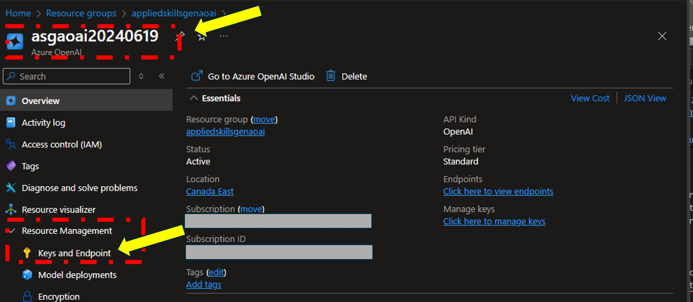 [alt text](README.md)

Once your Azure OpenAI Service is created in Azure Portal, then you can deploy a pre-trained GPT model that suits your scenario using the Azure AI Studio. Use the following link to access your newly created resoruce from Azure AI Studio. You will ned to create and save the following information for this POC:

a) Azure Model Name (Example: GPT4, GPT4o, etc...)

b) Azure Model Version

c) Azure Deployment Name

https://ai.azure.com/resource/deployments

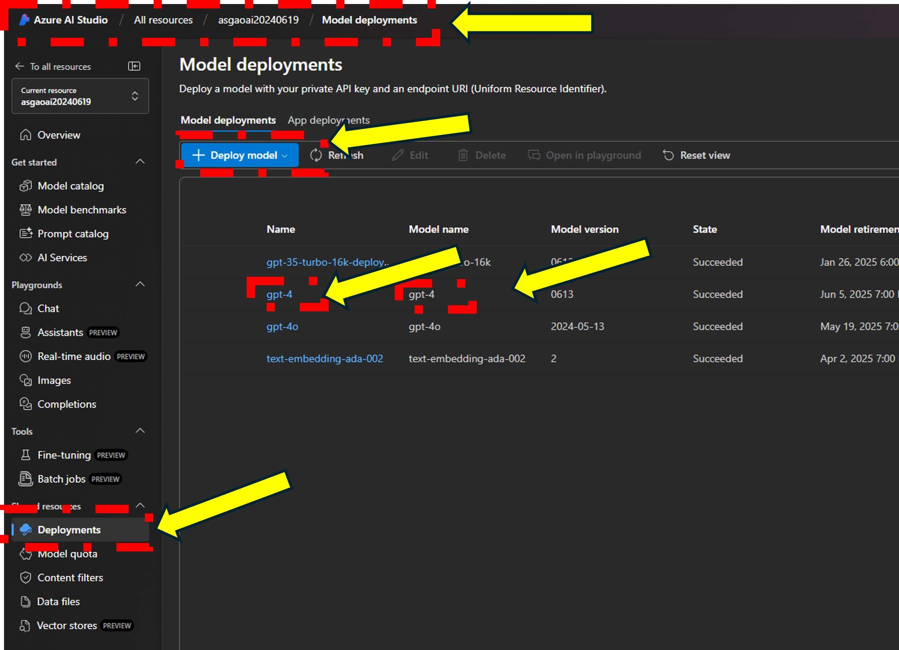

---

### Step 3: Installation

Now that you have created all environment resources, it is time to work on the machine where you want to run this Proof of Concept (POC) from.

The following are assumed to be done in preparation for this use case:

a) Install Python Version 3 (if not already)

b) Install Visual Studio Code (if not Already)

c) Download to a local directory the github repository

Action 1 of 4: Open the Project in VS Code as illustrated below:

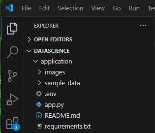

Action 2 of 4: Install the python requirements used in this POC by executing the following python command:
- Command: pip install -r requirements.txt
  
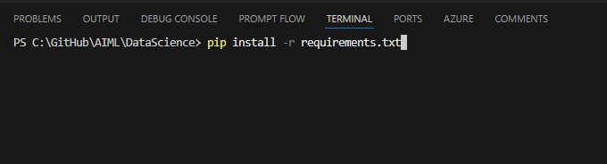
---
### Step 4: Update the python code settings

Action 3 of 4: Update the environment variable with your resources names, keys and endpoints as successfully done back on Step 2

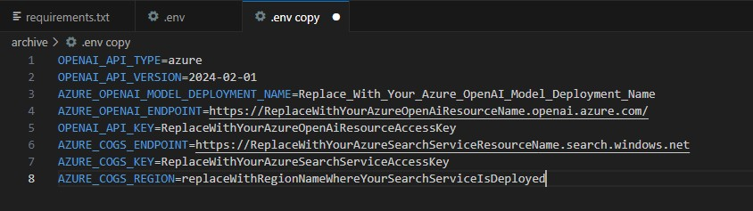

---
### Step 5: Running the Application

Action 4 of 4: If all previous steps were done successfully, you should be able to launch this python as a web-based local browser interface, upload your sample CSV File and start interacting with your file as shown below:

- Command: streamlit run app.py
- 
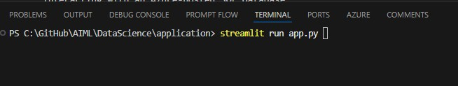

Success!!! Now you can start interacting with your application

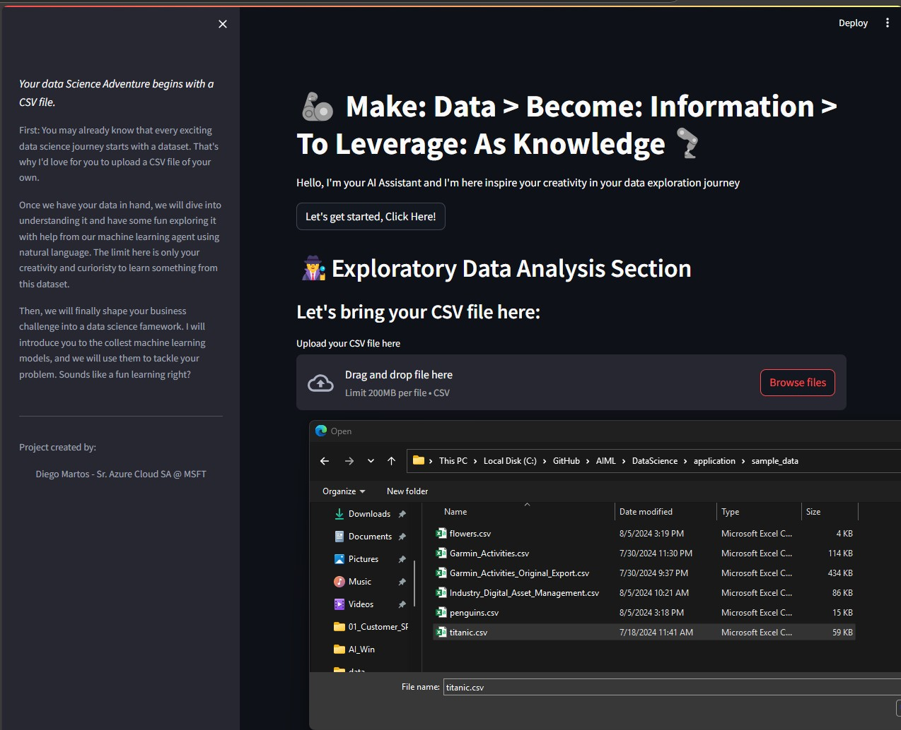

---

### Step 6: Next Steps

Now that you have succeeded mastering the main concepts behind this proof of concept, the next step is to bring it live in a Secure Azure Environment.

The following can be suggested as a framework of the things you should work on next. We are also providing a PowerPoint Template that can be used to discuss internally with the upper management and/or sponsors to make sure that this POC is aligned with business oportunity and priorities.

### Milestones for Proof of Concept (PoC)

By following these milestones and incorporating the security and monitoring aspects, you can develop a robust and secure PoC for your LLM-based web application

Define Objectives and Requirements

- Objective: Develop a web application using a Python-based LLM, leveraging Azure Cloud and Azure OpenAI, interacting with an Azure-hosted SQL Database.
- Requirements: Identify key functionalities, user interactions, and performance metrics.

Set Up Azure Environment

- Azure Subscription: Ensure you have an active Azure subscription.
Resource Group: Create a resource group to organize all related resources.

Develop the LLM in Python

- Model Training: Train your LLM using Python and necessary libraries.
- Integration with Azure OpenAI: Use Azure OpenAI to enhance the model's capabilities.

Deploy the Web Application

- Web App Service: Create an Azure Web App to host your application.
- Code Deployment: Deploy your Python application to the Azure Web App.

Set Up SQL Database

- Azure SQL Database: Create and configure an Azure SQL Database.
- API Integration: Develop API endpoints to interact with the SQL Database.

Secure Keys and Endpoints

- Azure Key Vault: Store API keys and endpoints securely in Azure Key Vault.
- Access Policies: Define access policies to control who can access the keys.

Implement Security and Privacy Measures
- Data Access Control: Ensure only authorized users have access to sensitive data.
- Encryption: Use encryption for data at rest and in transit.
- Compliance: Adhere to relevant compliance standards (e.g., GDPR, HIPAA).

Testing and Feedback
- User Testing: Allow selected users to test the application and provide feedback.
- Bug Fixes and Improvements: Iterate based on user feedback.
Monitoring and Evaluation
- Application Insights: Use Azure Application Insights to monitor application performance and user interactions.
- API Management: Implement Azure API Management to manage and secure your APIs, and to gather metrics on API usage.
Security Aspects
- Access Control: Implement role-based access control (RBAC) to restrict access to sensitive data and operations.
- Data Privacy: Ensure that user data is anonymized and handled according to privacy regulations.
- Responsible AI: Incorporate fairness, transparency, and accountability in your AI model to avoid biases and ensure ethical use.

Monitoring and Metrics
- Application Insights: Track performance metrics, error rates, and user behavior to gain insights into application performance and user experience.
- API Management: Monitor API usage, response times, and error rates to ensure efficient and secure API operations.

---

## Supporting Documentation

### Recommended Videos that Inspired this Asset:
- Building an AI Data Assistant with Streamlit, LangChain and OpenAI - https://www.youtube.com/watch?v=CBRE_Me1IQ0&list=PLPrPDH0IeIfmsGfyBWsYQkH64Nnb7v2UH
- CrewAI Step-by-Step | Complete Course for Beginners - https://www.youtube.com/watch?v=kBXYFaZ0EN0&list=PLPrPDH0IeIfmsGfyBWsYQkH64Nnb7v2UH

### Recommended Official Documentation
- AZ-900, Microsoft Azure Fundamentals - https://learn.microsoft.com/en-us/credentials/certifications/azure-fundamentals/
- Microsoft AI Fundamentals - https://learn.microsoft.com/en-us/training/paths/get-started-with-artificial-intelligence-on-azure/
- Microsoft Azure Applied Skills - https://learn.microsoft.com/en-us/credentials/browse/?credential_types=applied%20skills
